# US Tech-for-Good Guide

This is a living directory of US organisations, projects, networks, and people who use technology for public good: open data, civic tech, climate tech, accessibility, digital inclusion, humanitarian response, and more.

**Who this is for:** people looking for US tech-for-good groups to work with, volunteer with, learn from, or connect to each other.

**How this guide is built:** it's generated from the YAML entries in `data/entries/`. Accuracy comes first: an entry is only added once its website (or another reliable source) confirms the details. This is a work in progress. It will grow, and some links or details may go out of date over time. See [CONTRIBUTING.md](CONTRIBUTING.md) to add or fix an entry.

## How to read this

Entries are grouped by **domain**: the area of public good the organisation works in. Each entry is a short, plain-language block: what the organisation does, where it's based, its links, and its tags. Where two entries are linked (for example, one runs on another's data, or they grew out of the same network), that connection is shown as a line in the diagrams below. No connection is invented: a line only appears if it's recorded in the underlying data.

**Legend: domains in this guide**

- **Tech Ethics & Responsible AI** (tech-ethics / responsible-AI): 2 entries
- **Disability & Accessibility Tech** (disability & accessibility tech): 2 entries
- **Civic Tech** (civic-tech): 7 entries
- **GovTech** (govtech): 2 entries
- **Education Equity Tech** (education equity tech): 2 entries
- **Green & Climate Tech** (green / climate-tech): 2 entries
- **Housing & Homelessness Tech** (housing / homelessness tech): 1 entry
- **Mental Health Tech** (mental-health tech): 1 entry
- **Research & Education Tech** (research / education tech): 1 entry
- **Human Rights Tech** (human-rights tech): 3 entries
- **Digital Inclusion** (digital-inclusion): 2 entries
- **Food Rescue & Food Security Tech** (food-rescue / food-security tech): 1 entry
- **Open Data** (open-data): 2 entries
- **Journalism & Media Tech** (journalism / media-tech): 1 entry
- **Worker & Platform Co-ops** (worker-coop / platform-coop tech): 1 entry

**Total entries: 30, across 15 domains.**

## Ecosystem overview

This diagram shows the domains as nodes, sized by how many entries each holds, with a line drawn between two domains whenever at least one entry in one domain lists an entry in the other as related. Domains with no cross-domain links are shown on their own.

```mermaid
flowchart TD
    d0["Tech Ethics & Responsible AI<br/>(2 entries)"]
    d1["Disability & Accessibility Tech<br/>(2 entries)"]
    d2["Civic Tech<br/>(7 entries)"]
    d3["GovTech<br/>(2 entries)"]
    d4["Education Equity Tech<br/>(2 entries)"]
    d5["Green & Climate Tech<br/>(2 entries)"]
    d6["Housing & Homelessness Tech<br/>(1 entry)"]
    d7["Mental Health Tech<br/>(1 entry)"]
    d8["Research & Education Tech<br/>(1 entry)"]
    d9["Human Rights Tech<br/>(3 entries)"]
    d10["Digital Inclusion<br/>(2 entries)"]
    d11["Food Rescue & Food Security Tech<br/>(1 entry)"]
    d12["Open Data<br/>(2 entries)"]
    d13["Journalism & Media Tech<br/>(1 entry)"]
    d14["Worker & Platform Co-ops<br/>(1 entry)"]
```

### Domain close-ups

The domains below have enough internal connections to be worth zooming in on. Isolated entries (no recorded links) are included as standalone nodes so the diagram still shows the whole domain.

## Tech Ethics & Responsible AI

Groups working on the ethical, safe, and accountable use of technology and AI, including policy research and public education.

_2 entries in this domain._

**AI Now Institute**

- AI Now Institute is an independent research institute providing expert analysis on artificial intelligence in the public interest.
- Region: national
- Links: [Website](https://ainowinstitute.org)
- Tags: AI, research, policy, public interest

**Data & Society Research Institute**

- Data & Society is a research institute studying the social implications of data and automation. It argues that technology policy should be grounded in research about technology's real-world effects.
- Region: national
- Links: [Website](https://datasociety.net)
- Tags: research, technology policy, data, society

## Disability & Accessibility Tech

Tools and consultancy that make websites, services, and physical spaces usable by disabled people, and organisations advocating for that.

_2 entries in this domain._

**American Foundation for the Blind**

- The American Foundation for the Blind works to expand possibilities for the millions of Americans living with vision loss, and has done so since 1921.
- Region: national
- Links: [Website](https://www.afb.org)
- Tags: accessibility, blindness, vision loss, nonprofit

**Knowbility**

- Knowbility is a nonprofit based in Austin, Texas working to create an inclusive digital world for people with disabilities, through training, consulting, and advocacy. It was founded in 1999.
- Region: south-central
- Links: [Website](https://knowbility.org)
- Tags: accessibility, disability, training, consulting

## Civic Tech

Tools that help people take part in how their communities and government work: petitions, submissions, participatory budgeting, and ways to hold decision-makers to account.

_7 entries in this domain._

**Ballotpedia**

- Ballotpedia is a digital encyclopedia of American politics, covering elections, candidates, and ballot measures.
- Region: national
- Links: [Website](https://ballotpedia.org)
- Tags: elections, politics, reference, voting

**Center for Civic Design**

- The Center for Civic Design works on election design, so that voters can express their intent clearly. It publishes its research and field guides for election officials.
- Region: national
- Links: [Website](https://civicdesign.org)
- Tags: elections, design, accessibility, research

**Center for Tech and Civic Life**

- The Center for Tech and Civic Life works with election officials to modernise the American voting experience, through grants, research, and shared election infrastructure.
- Region: national
- Links: [Website](https://www.techandciviclife.org)
- Tags: elections, civic tech, grants, research

**Code for America**

- Code for America works with governments and communities across the country to break down barriers and find real solutions, and believes government at every level can work well for everyone.
- Region: national
- Links: [Website](https://codeforamerica.org)
- Tags: civic tech, government, digital services, nonprofit

**Democracy Works**

- Democracy Works builds tools and delivers election information that help millions of Americans vote, with the aim of removing the gaps that keep turnout low.
- Region: national
- Links: [Website](https://www.democracy.works)
- Tags: voting, elections, civic tech, information

**GovTrack**

- GovTrack tracks legislation and votes in the United States Congress and actions by the White House, and publishes the record where anyone can follow it.
- Region: national
- Links: [Website](https://www.govtrack.us)
- Tags: congress, legislation, transparency, open data

**Vote.org**

- Vote.org is a nonpartisan service for registering to vote, checking a registration, and requesting an absentee ballot.
- Region: national
- Links: [Website](https://www.vote.org)
- Tags: voting, registration, elections, nonpartisan

## GovTech

Software and data services built for or by government agencies, used to run public services or open government data to the public.

_2 entries in this domain._

**Beeck Center for Social Impact and Innovation**

- The Beeck Center at Georgetown University works on building a people-centred, digitally enabled government for all.
- Region: national
- Links: [Website](https://beeckcenter.georgetown.edu)
- Tags: govtech, research, public interest technology, university

**Coding it Forward**

- Coding it Forward is a nonprofit for early-career technologists. It runs the Coding it Forward Fellowship, a civic tech internship for students and recent graduates.
- Region: national
- Links: [Website](https://www.codingitforward.com)
- Tags: public interest technology, fellowship, students, civic tech

## Education Equity Tech

Tech that closes gaps in education: devices, coding programmes, and digital skills training for learners who wouldn't otherwise get them.

_2 entries in this domain._

**Benetech**

- Benetech is a nonprofit that creates software for social good in education, employment, and social inclusion, and offers free training for educators supporting students with diverse learning needs.
- Region: national
- Links: [Website](https://benetech.org)
- Tags: accessibility, education, software for good, nonprofit

**CodeAI**

- CodeAI is an education nonprofit working so that every student in every school can learn about artificial intelligence and computer science as part of their core K-12 education. It was previously known as Code.org.
- Region: national
- Links: [Website](https://code.org)
- Tags: computer science, education, K-12, AI

## Green & Climate Tech

Tools that measure, reduce, or help people respond to climate change and its effects, from carbon tracking to clean-energy platforms.

_2 entries in this domain._

**CarbonPlan**

- CarbonPlan works on the transparency and scientific integrity of climate solutions, publishing open data and tools alongside its analysis.
- Region: national
- Links: [Website](https://carbonplan.org)
- Tags: climate, open data, research, tools

**Rewiring America**

- Rewiring America works on electrifying American households, with the aim of clean energy that every household can afford.
- Region: national
- Links: [Website](https://www.rewiringamerica.org)
- Tags: electrification, clean energy, households, climate

## Housing & Homelessness Tech

Tools and data systems that help people find housing, coordinate homelessness services, or understand their rights as tenants.

_1 entry in this domain._

**Community Solutions**

- Community Solutions helps communities act with speed, coordination, and accountability to reduce homelessness, and publishes data on the progress those communities make.
- Region: national
- Links: [Website](https://community.solutions)
- Tags: homelessness, housing, data, nonprofit

## Mental Health Tech

Digital tools that support mental health and wellbeing, from self-help apps to platforms connecting people with support.

_1 entry in this domain._

**Crisis Text Line**

- Crisis Text Line provides free, 24-hour, confidential text support for people in crisis, in English and Spanish.
- Region: national
- Links: [Website](https://www.crisistextline.org)
- Tags: mental health, crisis support, text messaging, nonprofit

## Research & Education Tech

Research institutions and platforms studying or supporting technology's role in society, and education programmes about it.

_1 entry in this domain._

**DataKind**

- DataKind works with social sector organisations to design data science and AI projects in areas including health, humanitarian action, climate, and education.
- Region: national
- Links: [Website](https://www.datakind.org)
- Tags: data science, nonprofit, volunteers, AI

## Human Rights Tech

Digital campaigning, advocacy, and organising tools used to defend and advance human rights.

_3 entries in this domain._

**Electronic Frontier Foundation**

- The Electronic Frontier Foundation defends civil liberties in the digital world. It litigates, campaigns, and publishes tools and guides on privacy, free speech, creativity, and surveillance.
- Region: national
- Links: [Website](https://www.eff.org)
- Tags: digital rights, privacy, free speech, surveillance

**Freedom of the Press Foundation**

- Freedom of the Press Foundation builds and supports secure tools for journalists, and campaigns against threats to press freedom.
- Region: national
- Links: [Website](https://freedom.press)
- Tags: press freedom, journalism, security tools, encryption

**Public Knowledge**

- Public Knowledge promotes freedom of expression, an open internet, and access to affordable communications tools and creative works, through policy work on behalf of the public interest.
- Region: national
- Links: [Website](https://publicknowledge.org)
- Tags: internet policy, open internet, free expression, advocacy

## Digital Inclusion

Helping people who are shut out of the digital world get online, get devices, and build the skills and confidence to use them.

_2 entries in this domain._

**EveryoneOn**

- EveryoneOn connects under-resourced communities to affordable internet and computers, trains people and organisations in digital skills, and works for fair access policies.
- Region: national
- Links: [Website](https://www.everyoneon.org)
- Tags: digital inclusion, affordable internet, devices, digital skills

**Kapor Center**

- The Kapor Center is a family of organisations working to remove barriers for people of colour in the technology sector, through research, programmes, advocacy, and investment.
- Region: national
- Links: [Website](https://www.kaporcenter.org)
- Tags: racial equity, tech sector, research, investment

## Food Rescue & Food Security Tech

Platforms that move surplus food to people who need it, or help organisations measure and reduce food waste.

_1 entry in this domain._

**Feeding America**

- Feeding America is a nonprofit network of 200 food banks working to end hunger in the United States.
- Region: national
- Links: [Website](https://www.feedingamerica.org)
- Tags: food security, food banks, hunger, nonprofit

## Open Data

Government or organisational data published for anyone to use, and the platforms that host and serve it.

_2 entries in this domain._

**Open States**

- Open States publishes data on state legislatures across the United States. It covers who the legislators are, what they sponsor, and how they vote.
- Region: national
- Links: [Website](https://openstates.org)
- Tags: state legislatures, open data, legislation, api

**USAFacts**

- USAFacts publishes a nonpartisan view of the state of the country, built from government data and free for anyone to use.
- Region: national
- Links: [Website](https://usafacts.org)
- Tags: open data, government data, statistics, nonpartisan

## Journalism & Media Tech

Public-interest journalism and the platforms or funding that support independent, accountable reporting.

_1 entry in this domain._

**ProPublica**

- ProPublica is an independent, non-profit newsroom that produces investigative journalism in the public interest.
- Region: national
- Links: [Website](https://www.propublica.org)
- Tags: investigative journalism, nonprofit news, public interest

## Worker & Platform Co-ops

Technology built and owned cooperatively by the people who use or work on it, rather than by outside shareholders.

_1 entry in this domain._

**U.S. Federation of Worker Cooperatives**

- The U.S. Federation of Worker Cooperatives is the national membership organisation for worker cooperatives and democratic workplaces. It represents an estimated 1,300 US worker co-ops and their 15,000 workers.
- Region: national
- Links: [Website](https://usworker.coop)
- Tags: worker cooperatives, economic democracy, membership, advocacy

## How this is maintained / how to add an entry

This guide is generated from the YAML files in `data/entries/`, one file per entry. See [CONTRIBUTING.md](CONTRIBUTING.md) for the full step-by-step walkthrough. In short:

1. Copy `data/entry.template.yaml` to `data/entries/<slug>.yaml`.
2. Fill in the fields, verifying each against a live source.
3. Run `python3 scripts/validate.py` to check it against the schema.
4. Run `python3 scripts/build_guide.py` to regenerate this file, then open a pull request.

Entries are only added once verified against a live source. If you spot something out of date, check the entry's `source` field first, then update the YAML file in `data/entries/`.

